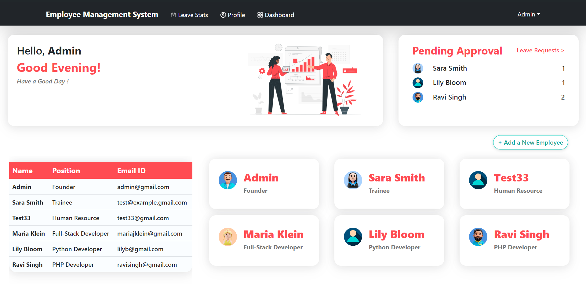

<div align="center">

# 🚀 Business Employee Management System 🚀

**A modern, full-stack web application designed to streamline HR processes and empower your workforce.**


</div>

<br>

<p align="center">
  
</p>

---

## ✨ Core Features

| Feature                 | Description                                                                                             |
| ----------------------- | ------------------------------------------------------------------------------------------------------- |
| 👤 **Admin Dashboard** | A powerful central hub for admins to manage all employees, view company stats, and handle requests.     |
| 🌴 **Leave Management** | Employees can request time off, and admins can approve or reject requests with a single click.          |
|  **Self-Service Portal** | Empowers employees to view and update their own profiles, ensuring data is always current.        |
| 📊 **Data Visualization** | Interactive charts display key metrics, like employee roles and who is on leave today.                  |
| 🔐 **Secure Auth** | Robust, role-based authentication ensures that users can only access the information they are permitted to. |

---

## 📸 Application Showcase

<table width="100%">
  <tr>
    <td width="50%" align="center">
      <h3>Admin Command Center</h3>
      
    </td>
    <td width="50%" align="center">
      <h3>Detailed Employee Profile</h3>
      
    </td>
  </tr>
</table>

---

## 🛠️ Tech Stack & Tools

- **Frontend:** React, React-Bootstrap, Ant Design
- **Backend:** Node.js, Express.js
- **Database:** MongoDB
- **Data Visualization:** Chart.js

---

## 🚀 Get Started Locally

Follow these steps to get the project running on your local machine.

1.  **Clone the Repo**
    ```sh
    git clone [https://github.com/tanmaymaind/business-employee-management.git](https://github.com/your-username/business-employee-management.git)
    cd business-employee-management
    ```

2.  **Backend Setup**
    ```sh
    cd backend
    npm install
    # Create a .env file and add your MONGO_URI
    npm start
    ```

3.  **Frontend Setup**
    ```sh
    cd ../frontend
    npm install
    npm start
    ```

4.  **Access the App**
    - Visit `http://localhost:3000` in your browser.
